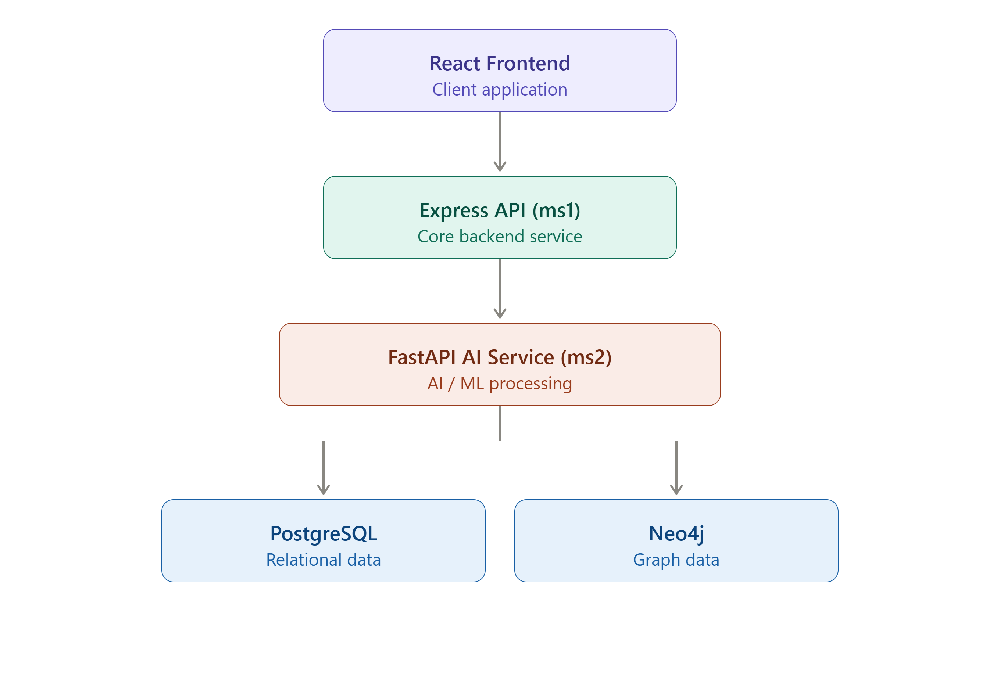

<div align="center">

# 🛡️ LogicFlow Guardian

### Agentic AI-powered Business Logic Security Testing Platform

Analyze source code, understand business workflows, generate intelligent security tests, execute them automatically, and produce explainable vulnerability reports.

---


</div>

---

# 📖 Overview

LogicFlow Guardian is an **Agentic AI-powered Business Logic Security Testing Platform** that helps developers detect vulnerabilities that traditional security scanners often miss.

Instead of searching only for known vulnerabilities like SQL Injection or XSS, LogicFlow Guardian understands the application's **business logic**, generates intelligent security test cases, executes them automatically, and produces explainable reports with remediation suggestions.

The platform is designed for:

- Backend Developers
- Security Engineers
- Penetration Testers
- QA Engineers

---

# 🚀 Features

- GitHub Repository Analysis
- Business Logic Understanding
- Knowledge Graph Generation
- LangGraph-powered AI Workflow
- Automated Security Test Generation
- Reflection-based Test Improvement
- Explainable Vulnerability Reports
- Analysis History
- JWT Authentication
- Dockerized Microservice Architecture

---

# 🏗️ System Architecture



```
React Frontend
        │
        ▼
Express.js (ms1)
        │
        ▼
FastAPI (ms2)
        │
 ┌──────┴────────┐
 ▼               ▼
PostgreSQL     Neo4j
```

Detailed architecture is available in:

```
docs/architecture.md
```

---

# 🤖 Agent Workflow

LogicFlow Guardian follows an agentic workflow powered by LangGraph.

```
Repository

↓

Clone Repository

↓

Parse Repository

↓

Build Knowledge Graph

↓

Planner Agent

↓

Generate Tests

↓

Execute Tests

↓

Analyze Results

↓

Reflection

↓

Generate Report
```

---

# 🧠 AI Components

The AI service is composed of multiple specialized agents.

| Agent | Responsibility |
|---------|----------------|
| Repository Parser | Parses source code |
| Graph Builder | Builds repository knowledge graph |
| Planner Agent | Generates business logic test plans |
| Test Executor | Executes generated security tests |
| Response Analyzer | Evaluates execution results |
| Reflection Agent | Generates additional tests if coverage is insufficient |
| Report Generator | Produces explainable reports |

---

# 🏛️ Project Structure

```
LogicFlow-Guardian/

├── frontend/
├── ms1-core-api/
├── ms2-agent/
├── infra/
├── docs/
└── .github/
```

---

# ⚙️ Technology Stack

| Layer | Technology |
|---------|------------|
| Frontend | React.js + TypeScript |
| Backend | Express.js |
| AI Service | FastAPI |
| Agent Framework | LangGraph |
| LLM Framework | LangChain |
| Database | PostgreSQL |
| Knowledge Graph | Neo4j |
| Authentication | JWT |
| Containerization | Docker |
| Reverse Proxy | NGINX |
| Cloud | AWS EC2 |
| CI/CD | GitHub Actions |
| Monitoring | OpenTelemetry |

Complete technology documentation:

```
docs/tech-stack.md
```

---

# 📂 Documentation

| Document | Description |
|-----------|-------------|
| architecture.md | System Architecture |
| tech-stack.md | Technology Decisions |
| schema.md | Database Schema |
| milestones.md | Development Roadmap |
| wireframes.md | Application Wireframes |

---

# 🗺️ Development Roadmap

## ✅ Milestone 1

- Repository Setup
- Wireframes
- System Architecture
- Technology Stack
- Database Schema
- LangGraph Design

## ⏳ Milestone 2

- React Frontend
- Authentication
- Express ↔ FastAPI Integration
- Basic Agent Workflow

## ⏳ Milestone 3

- Complete Local MVP
- Docker Compose
- Repository Parsing
- Knowledge Graph
- Security Test Execution

## ⏳ Milestone 4

- AWS Deployment
- HTTPS
- CI/CD
- NGINX
- Production Infrastructure

## ⏳ Milestone 5

- OpenTelemetry
- Monitoring
- Performance Metrics
- Edge Cases
- Production Hardening

---

# 🔄 Planned User Workflow

```
Login

↓

Dashboard

↓

New Analysis

↓

Repository Upload

↓

AI Analysis

↓

Knowledge Graph

↓

Security Report

↓

Analysis History
```

---

# 🎯 Project Goals

The primary objective of LogicFlow Guardian is to automate business logic security testing by combining:

- Static Repository Analysis
- AI Reasoning
- Knowledge Graphs
- Agentic Workflows
- Automated Test Execution
- Reflection-based Improvement

---

# 📌 Current Status

**Current Phase**

Milestone 1 – Project Design & Architecture

Completed:

- Repository Structure
- Documentation
- Wireframes
- Architecture Design
- Technology Stack
- Development Roadmap

Next:

Implementation of the React frontend, Express API, and FastAPI AI service.

---

# 👨‍💻 Team

| Member | Responsibility |
|---------|----------------|
| Yash | AI Architecture, LangGraph, FastAPI |
| Vansh | Frontend Development |
| Sneha | Express API & Database |

---

# 📜 License

This project is licensed under the MIT License.

---

<div align="center">

### LogicFlow Guardian

**Building the future of AI-driven Business Logic Security Testing**

</div>
