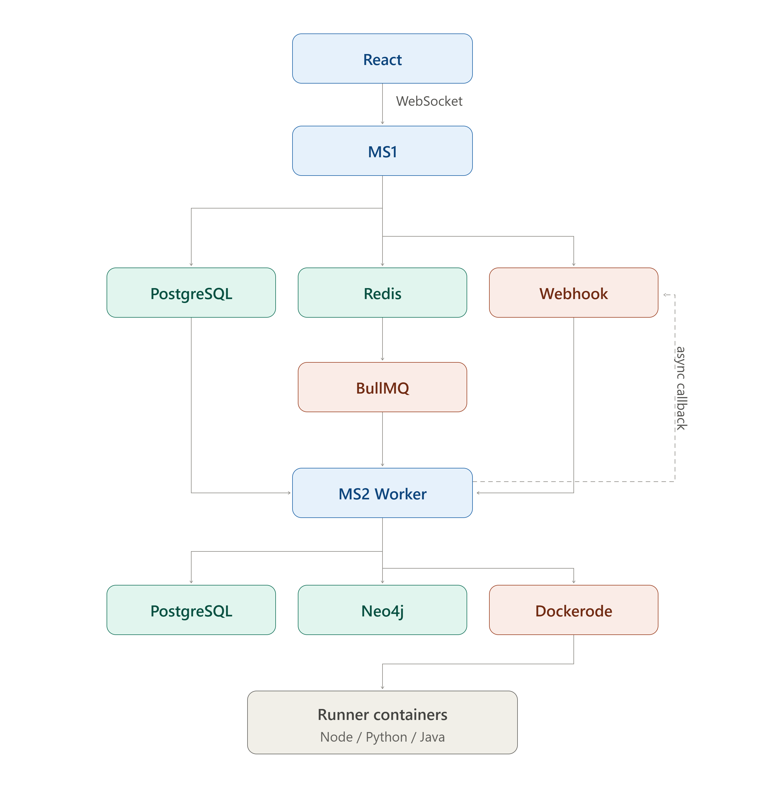

# System Architecture

# Overview

LogicFlow Guardian is an Agentic AI-powered Business Logic Vulnerability Testing Platform that automatically analyzes backend repositories, discovers business rules, generates intelligent security tests, safely executes those tests inside isolated environments, and produces explainable security reports.

The platform follows a production-oriented microservice architecture built around **asynchronous job processing**, **event-driven communication**, and **AI workflow orchestration**.

The system is divided into two independent backend services.

- **MS1 (Express.js)** – Core Application Service responsible for authentication, project management, repository management, report management, job scheduling, and frontend communication.
- **MS2 (FastAPI)** – AI Analysis Service responsible for repository parsing, knowledge graph construction, LangGraph execution, AI reasoning, container execution, reflection, and report generation.

Each service owns its own database and business domain.

The frontend never communicates directly with MS2.

---

# High-Level System Architecture

The following diagram illustrates the complete architecture.

---

# Core Components

| Component | Responsibility |
|------------|----------------|
| React Frontend | Authentication, dashboard, repository upload, live analysis progress, knowledge graph visualization, report viewing |
| MS1 (Express.js) | Authentication, JWT, project management, repository metadata, report storage, queue management, webhook receiver, websocket server |
| PostgreSQL (MS1) | Users, Projects, Repository Metadata, Analysis Jobs, Reports, Findings |
| Redis | Analysis job queue using BullMQ |
| BullMQ | Job scheduling, retries, concurrency management |
| MS2 (FastAPI) | Repository parsing, AI workflow execution, LangGraph orchestration, Docker execution, reflection, report generation |
| PostgreSQL (MS2) | Analysis sessions, execution logs, planner state, LangGraph state, token usage, reflection history |
| Neo4j | Repository knowledge graph |
| Dockerode | Starts and destroys isolated runner containers |
| Runner Images | Secure execution environments for Node, Python and Java projects |
| NGINX | HTTPS termination, reverse proxy and routing |
| OpenTelemetry | Distributed tracing and observability |

---

# Service Responsibilities

## MS1 (Express.js)

MS1 owns every business-facing responsibility.

Responsibilities include:

- User Authentication
- JWT Authorization
- Project Management
- Repository Registration
- Repository Metadata
- Report Storage
- Report Retrieval
- Analysis Job Creation
- Queue Management
- Webhook Receiver
- WebSocket Notifications

MS1 never performs AI analysis.

MS1 never executes repositories.

MS1 never communicates directly with Docker.

---

## MS2 (FastAPI)

MS2 owns the complete AI analysis lifecycle.

Responsibilities include:

- Repository Retrieval
- Repository Parsing
- Framework Detection
- Knowledge Graph Generation
- Business Rule Extraction
- LangGraph Execution
- Test Planning
- Runtime Discovery
- Docker Container Management
- Dynamic Test Execution
- Reflection
- Report Generation

MS2 is completely isolated from user management and business APIs.

---

# Database Ownership

The platform follows the **Database per Service** architecture.

Each microservice owns and manages its own persistence layer.

No service directly accesses another service's database.

Communication occurs only through APIs or asynchronous events.

---

## PostgreSQL (MS1)

Stores permanent application data.

Includes:

- Users
- Projects
- Repository Metadata
- Analysis Jobs
- Reports
- Findings
- Authentication Sessions

Historical reports are always served directly from this database.

---

## PostgreSQL (MS2)

Stores temporary AI execution data.

Includes:

- Analysis Sessions
- Planner State
- LangGraph State
- Reflection History
- Execution Logs
- Prompt Versions
- Token Usage
- Runtime Metadata
- Container Metadata

This database exists solely to support AI execution.

---

## Neo4j

Stores semantic repository relationships.

Example nodes:

- Repository
- Route
- Controller
- Middleware
- Service
- DTO
- Model
- Business Rule
- Finding
- Test Case

The graph enables dependency traversal and AI reasoning.

---

# Analysis Queue

Repository analysis is intentionally asynchronous.

When a repository is submitted:

Frontend

↓

MS1

↓

Create Analysis Job

↓

Redis Queue

↓

Return Job ID

↓

Frontend receives immediate response

MS1 never waits for AI execution.

This design enables thousands of queued analyses without blocking API requests.

---

# MS1 ↔ MS2 Communication

MS1 communicates with MS2 through REST APIs only for job submission.

MS2 communicates back to MS1 using Webhooks.

Workflow:

MS1

↓

POST /analysis

↓

Queue Job

↓

MS2 Worker

↓

Analysis Complete

↓

Webhook

↓

MS1 stores report

This eliminates polling between services.

---

# Real-Time Client Updates

The frontend never polls the backend.

Instead:

React

↓

WebSocket

↓

MS1

↓

Analysis Status Updates

Example states:

- Queued
- Cloning Repository
- Parsing Repository
- Building Knowledge Graph
- Planning Tests
- Executing Tests
- Reflection
- Report Generation
- Completed

This provides a real-time user experience similar to GitHub Actions.

---

# Repository Lifecycle

Every uploaded repository follows the same lifecycle.

Repository Submitted

↓

Stored on Disk (future: AWS S3)

↓

Repository Registered

↓

Queue Job Created

↓

MS2 Worker Receives Job

↓

Repository Analysis

↓

Report Generated

↓

Webhook to MS1

↓

Permanent Report Storage

↓

User Notification

The repository itself is never stored inside PostgreSQL.

Only metadata and storage paths are stored.

---

# AI Workflow

The AI workflow is orchestrated using LangGraph.

Pipeline:

Repository Retrieval

↓

Repository Parser

↓

Framework Detection

↓

Knowledge Graph Builder

↓

Business Rule Extraction

↓

Planner Agent

↓

Runtime Discovery

↓

Dynamic Test Execution

↓

Reflection Agent

↓

Report Generator

↓

Webhook

Reflection may redirect execution back to the Planner whenever additional coverage is required.

---

# Runtime Execution

Repositories are never executed directly on the host machine.

Instead:

Repository

↓

Runner Image Selected

↓

Docker Container Created

↓

Repository Mounted

↓

Dependencies Installed

↓

Application Started

↓

Health Check

↓

AI Executes Tests

↓

Container Destroyed

This guarantees secure execution.

---

# Runner Images

The platform maintains trusted execution environments.

Examples:

- logicflow-node-runner
- logicflow-python-runner
- logicflow-java-runner

Repositories are mounted into these containers.

User-provided Dockerfiles are never executed.

---

# Docker Management

Docker containers are managed exclusively by MS2 using Dockerode.

Responsibilities include:

- Container Creation
- Resource Limits
- Log Streaming
- Health Checks
- Timeouts
- Cleanup

Each container has:

- CPU limits
- Memory limits
- Network restrictions
- Execution timeout
- Automatic cleanup

No repository executes outside an isolated container.

---

# Request Lifecycle

The request lifecycle consists of two independent flows.

## Business Flow

User

↓

React

↓

MS1

↓

Database

↓

Queue Job

↓

Response

---

## AI Flow

Queue

↓

MS2 Worker

↓

Repository Analysis

↓

Knowledge Graph

↓

Planner

↓

Execution

↓

Reflection

↓

Report

↓

Webhook

↓

MS1 Database

↓

WebSocket Notification

↓

Frontend

---

# Deployment Architecture

Production deployment consists of independent containers.

Components:

- React
- NGINX
- MS1
- MS2
- Redis
- PostgreSQL (MS1)
- PostgreSQL (MS2)
- Neo4j

All services execute inside Docker.

NGINX provides HTTPS termination and request routing.

Redis enables asynchronous processing.

Every component can scale independently.

---

# Scalability Strategy

The architecture supports horizontal scaling.

Future scaling strategies include:

- Multiple MS2 Workers
- Multiple BullMQ Workers
- Kubernetes Deployment
- Distributed Redis
- Shared S3 Repository Storage
- Read Replicas
- Multiple Neo4j Instances
- Distributed Runner Pools

Workers can be increased without changing application logic.

---

# Failure Handling

The architecture is designed to tolerate failures.

Examples:

- Worker crashes
- Repository startup failures
- Infinite loops
- Memory exhaustion
- Invalid repositories
- Queue retries
- Container timeouts
- AI failures

Failed jobs are retried automatically through BullMQ.

Container failures never affect the host machine.

---

# Observability

Every analysis is fully traceable.

OpenTelemetry captures:

- Queue latency
- Repository parsing time
- Graph generation time
- AI token usage
- Docker startup time
- Test execution time
- Reflection iterations
- Total analysis duration

Distributed traces span:

React

↓

MS1

↓

Redis

↓

MS2

↓

Docker

↓

Webhook

↓

MS1

↓

Frontend

---

# Architectural Principles

The platform follows the following principles.

- Microservice Architecture
- Database per Service
- Event-Driven Communication
- Asynchronous Processing
- Queue-Based Execution
- Stateless Services
- AI Isolation
- Secure Containerized Execution
- Explainable AI
- Modular LangGraph Nodes
- Production-Ready Scalability
- Independent Horizontal Scaling
- Secure Internal APIs
- Container-First Deployment
- Failure Isolation
- Real-Time Client Communication