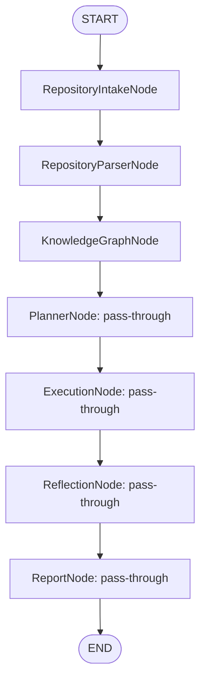
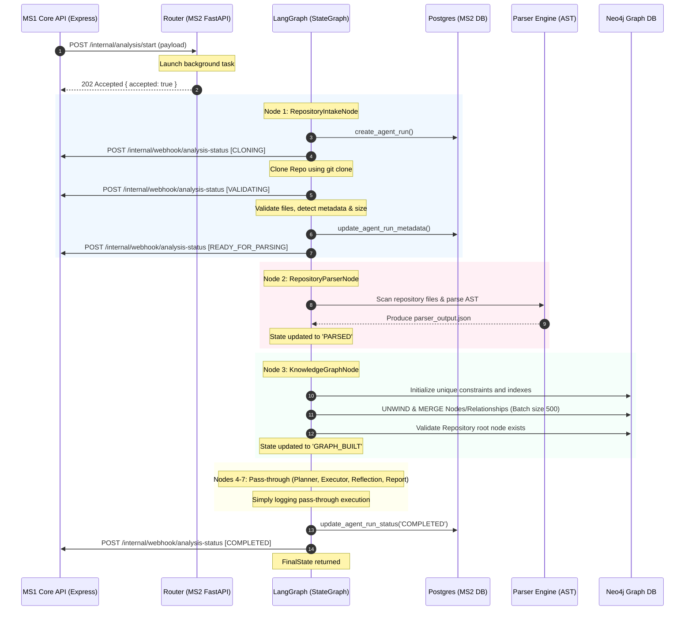

# LogicFlow Guardian - Current System Workflows

This document provides a technical overview of the system workflows as they are actually implemented in the codebase. It serves as a guide for developers to understand the current architecture, data flows, and active features.

---

## 1. Overall System Architecture & Request Flow

The system consists of three main components:
1. **Frontend (React + Vite)**: Handles user authentication UI and project management. Currently, it has no user interface or service methods for running or viewing analyses.
2. **MS1 Core API (Express.js + TypeScript)**: Exposes APIs for authentication and project management, handles the task queue (BullMQ), and manages business state in PostgreSQL.
3. **MS2 Agent Service (FastAPI + Python)**: Exposes internal APIs, orchestrates the analysis pipeline via **LangGraph**, builds a repository inventory and AST parser representation, and ingests semantic data into a **Neo4j** knowledge graph.

### Overall Workflow Diagram
```
  [Frontend (React/Vite)]
             │
             │ (HTTP REST: /api/auth/*, /api/projects/*)
             ▼
      [MS1 (Express.js)] ◄─── (Direct PostgreSQL updates) ──────┐
             │                                                  │
             │ (Enqueues Job)                                   │
             ▼                                                  │
       [Redis/BullMQ]                                           │
             │                                                  │
             │ (Worker Consumes)                                │
             ▼                                                  │
      [Analysis Worker]                                         │
             │                                                  │
             │ (POST /internal/analysis/start)                  │
             ▼                                                  │
       [MS2 (FastAPI)]                                          │
             │                                                  │
             │ (FastAPI BackgroundTasks)                        │
             ▼                                                  │
     [LangGraph Workflow] ──────────────────────────────────────┘
      - AnalysisState (cloned path, sizes, metadata)
      - Nodes: Intake ──> Parser ──> Neo4j Graph ──> Placeholder Steps
      - Webhooks sent to MS1 Webhook Endpoint
        (POST /internal/webhook/analysis-status)
```

---

## 2. Authentication Flow

Authentication is managed entirely by MS1 using JWT tokens and standard hashing.

### Registration Workflow
```
[Frontend (UI)] ── POST /api/auth/register ──► [AuthController.register]
                                                        │
                                                        ▼
                                             [AuthService.registerUser]
                                                        │
                                                        ├─► UserModel.findByEmail (Check duplicate)
                                                        ├─► Hash password via bcrypt (10 rounds)
                                                        ▼
[Frontend (UI)] ◄── 201 Created (userId) ─────── [UserModel.create]
```

- **Endpoints & Files Involved**:
  - `POST /api/auth/register` (Public)
  - **Routes**: [auth.routes.ts](file:///c:/Users/YASH/Desktop/LogicFlow-Guardian/ms1-core-api/src/routes/auth.routes.ts)
  - **Controller**: `AuthController.register` in [auth.controller.ts](file:///c:/Users/YASH/Desktop/LogicFlow-Guardian/ms1-core-api/src/controllers/auth.controller.ts)
  - **Service**: `AuthService.registerUser` in [auth.service.ts](file:///c:/Users/YASH/Desktop/LogicFlow-Guardian/ms1-core-api/src/services/auth.service.ts)
  - **Model**: `UserModel.create` in [user.model.ts](file:///c:/Users/YASH/Desktop/LogicFlow-Guardian/ms1-core-api/src/models/user.model.ts)

### Login Workflow
```
[Frontend (UI)] ── POST /api/auth/login ──► [AuthController.login]
                                                     │
                                                     ▼
                                            [AuthService.loginUser]
                                                     │
                                                     ├─► UserModel.findByEmail
                                                     ├─► Compare password via bcrypt.compare
                                                     ├─► Sign JWT (expires in 24h)
                                                     ▼
[Frontend (UI)] ◄── 200 OK (token, user metadata) ───┘
```

- **Endpoints & Files Involved**:
  - `POST /api/auth/login` (Public)
  - **Routes**: [auth.routes.ts](file:///c:/Users/YASH/Desktop/LogicFlow-Guardian/ms1-core-api/src/routes/auth.routes.ts)
  - **Controller**: `AuthController.login` in [auth.controller.ts](file:///c:/Users/YASH/Desktop/LogicFlow-Guardian/ms1-core-api/src/controllers/auth.controller.ts)
  - **Service**: `AuthService.loginUser` in [auth.service.ts](file:///c:/Users/YASH/Desktop/LogicFlow-Guardian/ms1-core-api/src/services/auth.service.ts)

### Token Verification
- **Middleware**: `authMiddleware` in [auth.middleware.ts](file:///c:/Users/YASH/Desktop/LogicFlow-Guardian/ms1-core-api/src/middleware/auth.middleware.ts)
- **Logic**: Intercepts requests, extracts JWT from the `Authorization` header (`Bearer <token>` or raw `<token>`), verifies it using `env.JWT_SECRET`, and attaches `{ userId, name, email }` to the Express request object (`req.user`).

---

## Project Creation Flow

Allows users to define target codebases for analysis.

### Project Creation Workflow
```
[Frontend (Dashboard)] ── POST /api/projects ──► [ProjectController.createProject]
                                                            │
                                                            ▼
                                                [ProjectService.createProject]
                                                            │
                                                            ▼
                                                  [ProjectModel.create]
                                                            │
                                                            ▼
                                                 INSERT INTO "Project"
                                                            │
[Frontend (Dashboard)] ◄── 201 Created (projectId) ─────────┘
```

- **Endpoints & Files Involved**:
  - `POST /api/projects` (Requires JWT)
  - **Routes**: [project.routes.ts](file:///c:/Users/YASH/Desktop/LogicFlow-Guardian/ms1-core-api/src/routes/project.routes.ts)
  - **Controller**: `ProjectController.createProject` in [project.controller.ts](file:///c:/Users/YASH/Desktop/LogicFlow-Guardian/ms1-core-api/src/controllers/project.controller.ts)
  - **Service**: `ProjectService.createProject` in [project.service.ts](file:///c:/Users/YASH/Desktop/LogicFlow-Guardian/ms1-core-api/src/services/project.service.ts)
  - **Model**: `ProjectModel.create` in [project.model.ts](file:///c:/Users/YASH/Desktop/LogicFlow-Guardian/ms1-core-api/src/models/project.model.ts)

---

## 4. Analysis Creation & Job Queue Flow

Starts an analysis pipeline. (Note: Currently triggered via REST API endpoints directly, as no UI integration is implemented for starting analyses).

### Analysis Pipeline Workflow
```
[Client] ── POST /api/analysis/start ──► [AnalysisController.startAnalysis]
                                                       │
                                                       ▼
                                            [AnalysisService.startAnalysis]
                                                       │
                                                       ├─► ProjectModel.findById (verify owner)
                                                       ├─► AnalysisModel.create (inserts status 'QUEUED')
                                                       │
                                                       ▼
                                                 [BullMQ Queue]
                                                       │
                             ┌─────────────────────────┴────────────────────────┐
                             ▼ (Success)                                        ▼ (Fail)
                   Set bull_job_id in DB                              Update status → 'FAILED'
                             │                                                  │
[Client] ◄── 201 Created (analysisId, status)                                  ▼
                                                                      Return status 500 / 503
```

- **Endpoints & Files Involved**:
  - `POST /api/analysis/start` (Requires JWT)
  - **Routes**: [analysis.routes.ts](file:///c:/Users/YASH/Desktop/LogicFlow-Guardian/ms1-core-api/src/routes/analysis.routes.ts)
  - **Controller**: `AnalysisController.startAnalysis` in [analysis.controller.ts](file:///c:/Users/YASH/Desktop/LogicFlow-Guardian/ms1-core-api/src/controllers/analysis.controller.ts)
  - **Service**: `AnalysisService.startAnalysis` in [analysis.service.ts](file:///c:/Users/YASH/Desktop/LogicFlow-Guardian/ms1-core-api/src/services/analysis.service.ts)
  - **Model**: `AnalysisModel` in [analysis.model.ts](file:///c:/Users/YASH/Desktop/LogicFlow-Guardian/ms1-core-api/src/models/analysis.model.ts)
- **Logic**:
  1. Validates request body for `projectId`.
  2. Verifies project exists and belongs to the user.
  3. Creates an `"Analysis"` record with status `'QUEUED'` in MS1's PostgreSQL database.
  4. Enqueues a job in `AnalysisQueue` containing the full project data payload:
     ```json
     {
       "analysisId": 5001,
       "projectId": 101,
       "userId": 1,
       "repoUrl": "https://github.com/...",
       "repoName": "repo",
       "branch": "main",
       "repositoryType": "github"
     }
     ```
  5. Stores the BullMQ job ID in the database and returns a success response. Upon failure, sets the status in PostgreSQL to `'FAILED'`.

---

## 5. BullMQ & Worker Architecture

The background job system is hosted entirely in MS1 and communicates asynchronously with MS2.

```
          [AnalysisQueue (Redis)]
                     │
                     ▼ (concurrency: 5)
          [AnalysisWorker]
                     │
                     ▼
          Update status → 'PROCESSING'
          Set started_at = current time
                     │
                     ▼
          [dispatchAnalysisToMs2]
                     │
                     ▼ (HTTP POST /internal/analysis/start)
                     │
         ┌───────────┴───────────┐
         ▼ (MS2 ACK)             ▼ (MS2 Fail / Timeout)
Update status → 'DISPATCHED'   Update status → 'FAILED'
```

- **Queue Location**: Located **before** MS2 (inside MS1, utilizing a local/remote Redis store). MS2 has no access to Redis or the BullMQ instance.
  - **Queue Name**: `AnalysisQueue`
  - **Configuration**: [queue.ts](file:///c:/Users/YASH/Desktop/LogicFlow-Guardian/ms1-core-api/src/config/queue.ts)
- **Producer**: `AnalysisService` (MS1 Core API) enqueues jobs.
- **Consumer**: `AnalysisWorker` (MS1 Core API background process).
- **Worker Source**: [analysis.worker.ts](file:///c:/Users/YASH/Desktop/LogicFlow-Guardian/ms1-core-api/src/workers/analysis.worker.ts)
  - Started on server initialization in [server.ts](file:///c:/Users/YASH/Desktop/LogicFlow-Guardian/ms1-core-api/src/server.ts).
  - Concurrency is configured to `5`.
- **Inter-service Dispatcher**: `dispatchAnalysisToMs2` in [dispatch.service.ts](file:///c:/Users/YASH/Desktop/LogicFlow-Guardian/ms1-core-api/src/services/dispatch.service.ts).
  - Sends a POST request to MS2 (`/internal/analysis/start`).
  - Upon successful dispatch (MS2 response `{ accepted: true }`), updates PostgreSQL status of the analysis to `'DISPATCHED'`. Upon failure, updates PostgreSQL status to `'FAILED'`.

---

## 6. LangGraph Orchestration & Webhook Callback Flow (MS2)

Upon receipt of an analysis request, MS2 executes the analysis pipeline using a LangGraph StateGraph orchestration layer. The workflow execution runs inside a FastAPI background task to ensure non-blocking dispatch response.

### LangGraph Workflow Flowchart



### Detailed Sequence Diagram



- **Endpoint**: `/internal/analysis/start`
- **Route File**: [internal.py](file:///c:/Users/YASH/Desktop/LogicFlow-Guardian/ms2-agent/app/routers/internal.py)
- **LangGraph Entry**: `run_analysis_workflow` in [invocation.py](file:///c:/Users/YASH/Desktop/LogicFlow-Guardian/ms2-agent/graphs/invocation.py)
- **Node Execution Logic**:
  1. **RepositoryIntakeNode**: Clones the repo, validates its structure, detects language and framework, computes size, updates PostgreSQL `agent_run` table, and sends status updates back to MS1 via webhook callbacks (`CLONING`, `VALIDATING`, `READY_FOR_PARSING`).
  2. **RepositoryParserNode**: Scans directories, excludes build artifacts, parses source code using python `ast` (for `.py`) and regex (for `.js`/`.ts`), and saves a structured Intermediate Representation (IR) to `workspace/analysis-{id}/parser_output.json`.
  3. **KnowledgeGraphNode**: Normalizes parser output into entity objects, applies unique constraints, bulk upserts nodes/relationships into Neo4j in batches of 500, and verifies the repository root node exists.
  4. **Planner, Execution, Reflection, Report Nodes**: Future placeholders that log execution and pass the state through unmodified.
  5. **Completion / Failure Handler**: Updates the database to `COMPLETED`/`FAILED` and notifies MS1 core API via webhook.

---

## 7. Database Ownership & Schema Details

Under the Database per Service architecture, the services own separate PostgreSQL databases:

### MS1 PostgreSQL Database
- **`"User"`**: Stores registered users.
- **`"Project"`**: Stores project metadata owned by users.
- **`"Analysis"`**: Stores the execution logs status, queue details, and final repository metadata sent from MS2 via webhooks.

### MS2 PostgreSQL Database
- **`agent_run`**: Stores execution states, workspace directories, language/framework detection results, and error details for trace logging. MS2 never reads or writes to MS1 tables.

### Neo4j Graph Database
- Stores code entities (files, classes, functions, routes, middleware, imports, exports) and relationships (`CONTAINS`, `DECLARES`, `EXTENDS`, `IMPORTS`, `EXPORTS`, `HAS_ROUTE`, `OWNS`) to build a semantic map of code structure.

### Migration & Initialization Process
- **MS1**: Managed via application-specific schema setups.
- **MS2**: Uses a raw SQL migration script located at `app/config/migrations/001_create_agent_run.sql`.
- **Auto-Initialization**: When MS2 launches, the system runs startup connection verification and executes `Base.metadata.create_all` using SQLAlchemy ORM to verify or initialize the `agent_run` schema automatically.

---

## 8. Technology/Infrastructure Details

- **Redis**: Used by MS1 via `ioredis` to back the BullMQ job queue. MS2 does not connect to or utilize Redis.
- **WebSockets**: **None**. There is no WebSocket server or client implementation in the codebase.
- **Webhooks**: **Yes**. Webhooks are fully implemented for status communication from MS2 to MS1. MS1 validates the request with a shared webhook secret header (`X-Webhook-Secret`).
- **Docker**: **None**. There is no Docker integration, containerization script, or Dockerode execution in the codebase (only a placeholder directory `infra/docker/` with a `.gitkeep` file).
- **LangGraph**: **Yes**. The pipeline is fully orchestrated using LangGraph `StateGraph`, maintaining execution logs, metadata, and error structures.
- **Neo4j Aura / Local**: Bolt driver connects to the local community database or Neo4j Aura cloud instance depending on `NEO4J_URI` configuration.

---

## 9. Codebase vs. Documentation Mismatches

Discrepancies that remain (future features):
- **Missing Tables**: Database documentation contains `Report`, `Endpoint`, `Finding`, and `TestCase` tables (`docs/schema.md`). These are future extensions and do not exist in the code yet.
- **WebSockets**: Real-time notifications are documented to occur via WebSockets (`docs/architecture.md`), which are not implemented in the codebase yet.
- **Docker Validation & Run**: Future runner stages will run in Docker sandboxes. These are currently simulated or pass-through.
