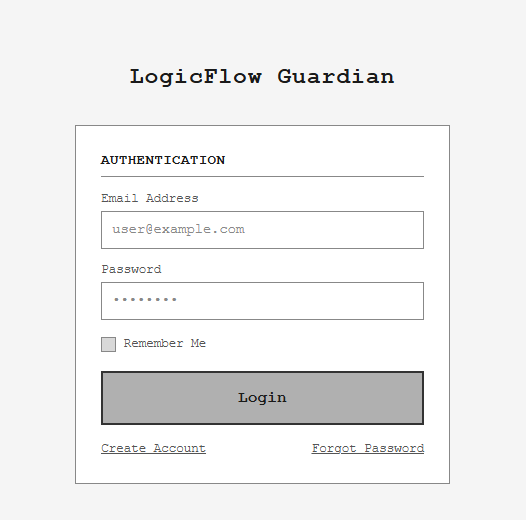
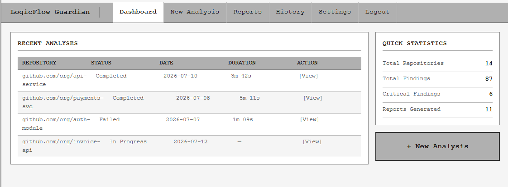
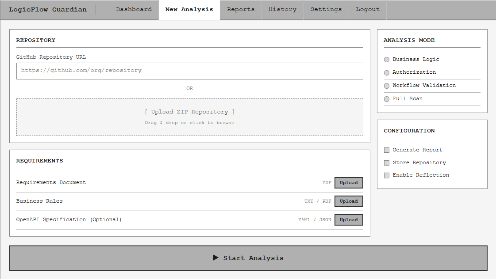
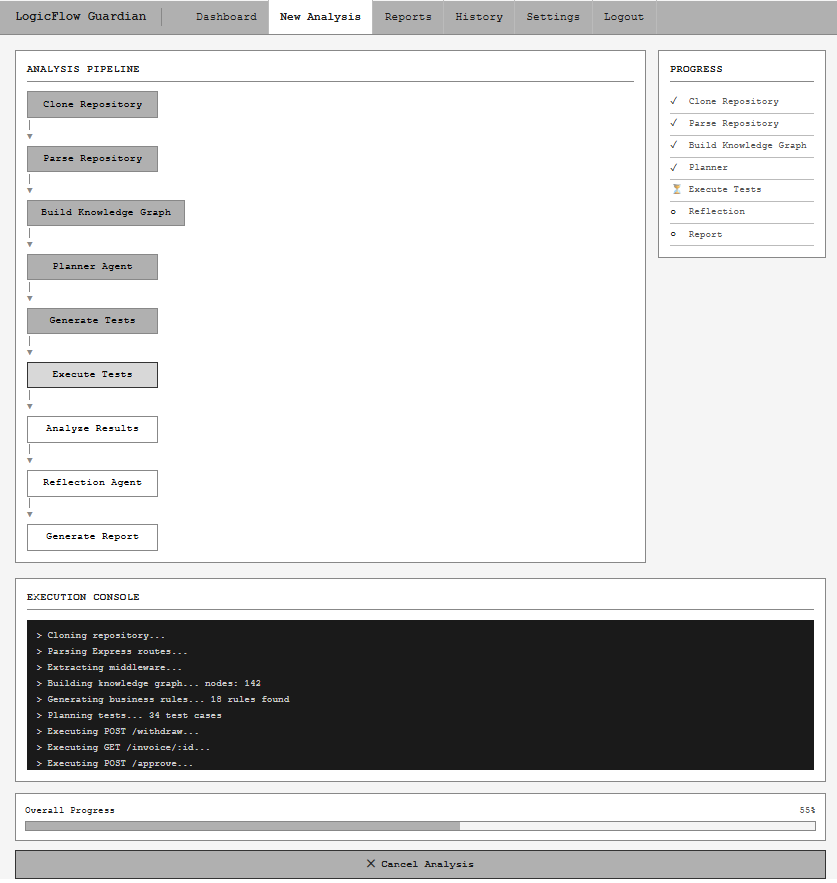
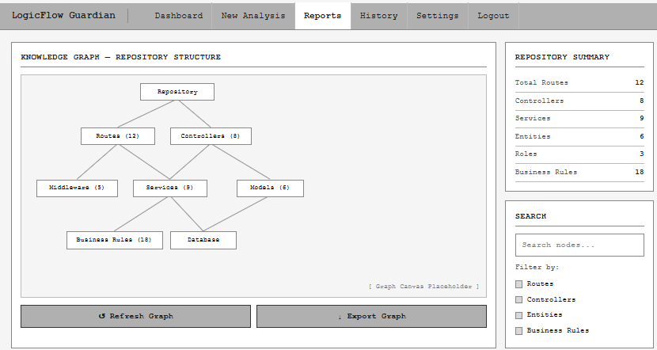
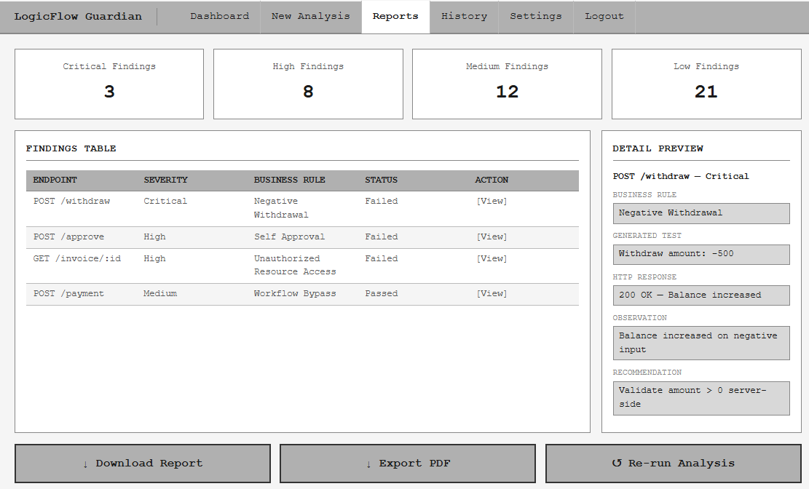

# LogicFlow Guardian - Wireframes

## Overview

This document contains the low-fidelity wireframes for **LogicFlow Guardian**, an Agentic AI-powered Business Logic Security Testing Platform.

These wireframes represent the planned user interface for the MVP and are intended to communicate application flow, information hierarchy, and user interactions before implementation.

---

# User Flow

```text
Login
    ↓
Dashboard
    ↓
New Analysis
    ↓
Analysis Progress
    ↓
Knowledge Graph
    ↓
Security Report
```

---

# Screen 1 — Login

### Purpose

Authenticate developers before allowing access to repositories, reports, and analyses.

### Features

- Email Login
- Password Login
- Remember Me
- Forgot Password
- Create Account

### Wireframe



---

# Screen 2 — Dashboard

### Purpose

Provides an overview of previous analyses and acts as the application's landing page.

### Features

- Recent Analyses
- Statistics
- Navigation
- Create New Analysis

### Wireframe



---

# Screen 3 — New Analysis

### Purpose

Allows developers to submit a GitHub repository together with supporting documentation.

### Features

- GitHub Repository URL
- Upload ZIP
- Upload Requirements
- Upload Business Rules
- Upload OpenAPI Specification
- Analysis Configuration
- Start Analysis

### Wireframe



---

# Screen 4 — Analysis Progress

### Purpose

Displays the real-time execution of the AI agent while it analyzes the repository.

### Features

- Agent Pipeline
- Live Execution Logs
- Progress Checklist
- Analysis Status

### AI Workflow

```text
Clone Repository
        ↓
Parse Repository
        ↓
Build Knowledge Graph
        ↓
Planner Agent
        ↓
Generate Tests
        ↓
Execute Tests
        ↓
Analyze Results
        ↓
Reflection Agent
        ↓
Generate Report
```

### Wireframe



---

# Screen 5 — Knowledge Graph

### Purpose

Visualizes the relationships discovered inside the uploaded repository.

### Example Relationships

```text
Repository
    ↓
Routes
    ↓
Controllers
    ↓
Services
    ↓
Middleware
    ↓
Models
    ↓
Business Rules
```

### Features

- Interactive Graph (future)
- Repository Summary
- Search
- Filters

### Wireframe



---

# Screen 6 — Security Report

### Purpose

Displays all business logic vulnerabilities discovered during analysis.

### Features

- Security Summary
- Findings Table
- Severity Distribution
- Recommendation Panel
- Export Report

### Wireframe



---

# Navigation Flow

```text
Login
    ↓
Dashboard
    ↓
New Analysis
    ↓
Analysis Progress
          │
          ▼
Knowledge Graph
          │
          ▼
Security Report
```

---

# Notes

These wireframes are intentionally low-fidelity and focus on application structure rather than visual design. They will serve as the blueprint for the React frontend implementation during subsequent milestones.